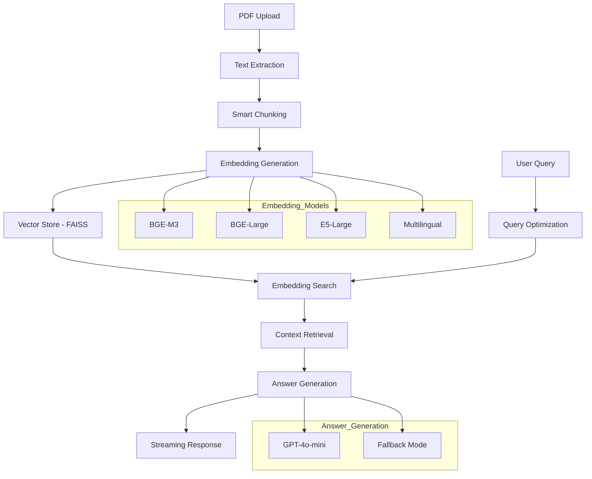

# 📊 Financial RAG Q&A System

> **Advanced Retrieval-Augmented Generation system for financial document analysis powered by state-of-the-art embeddings and GPT-4o-mini**

[](https://www.python.org/downloads/)
[](https://streamlit.io)
[](https://opensource.org/licenses/MIT)
[](https://github.com)

A production-ready RAG (Retrieval-Augmented Generation) system specifically designed for financial document analysis. Upload PDFs, ask natural language questions, and get accurate answers with precise source attribution.


---

## 🚀 **Key Features**

### 🧠 **Advanced AI Architecture**
- **Multiple Embedding Models**: Support for BAAI BGE, E5, and multilingual models
- **Smart Query Optimization**: AI-powered query rewriting for better retrieval
- **Hybrid Search**: Dense vector search with FAISS optimization
- **Streaming Responses**: Real-time answer generation with GPT-4o-mini

### 📄 **Document Processing**
- **Intelligent PDF Parsing**: Extract and clean text from complex financial documents
- **Adaptive Chunking**: Model-specific chunk sizing (BGE-M3: 1500 tokens, others: 500 tokens)
- **Context Preservation**: Smart overlap to maintain semantic continuity
- **Multi-document Support**: Query across multiple uploaded documents

### 💡 **User Experience**
- **Web Interface**: Clean, intuitive Streamlit dashboard
- **Source Attribution**: Every answer shows exact page references
- **Query History**: Track and reuse previous questions
- **Fallback Mode**: Works without API key using spaCy extraction
- **Sample Questions**: Pre-loaded financial accounting queries

### ⚡ **Performance & Scalability**
- **GPU Acceleration**: CUDA support for faster embedding generation
- **Batch Processing**: Optimized embedding generation with progress tracking
- **Memory Efficient**: Smart resource management for large documents
- **Cost Optimized**: ~$0.001 per query using GPT-4o-mini

---

## 🏗️ **Architecture**



---

## 📦 **Installation**

### Prerequisites
- Python 3.9 or higher
- 4GB+ RAM recommended
- Optional: CUDA-compatible GPU for acceleration

### Quick Start
```bash
# Clone the repository
git clone https://github.com/jayeshbankoti007/Financial_RAG.git
cd Financial_RAG

# Create virtual environment
python -m venv venv
source venv/bin/activate  # On Windows: venv\Scripts\activate

# Install dependencies
pip install -r requirements.txt

# Download spaCy model
python -m spacy download en_core_web_sm

# Run the application
streamlit run streamlit_app.py
```

### Docker Installation (Coming Soon)
```bash
docker build -t financial-rag .
docker run -p 8501:8501 financial-rag
```

---

## 🎯 **Usage**

### 1. **Setup OpenAI API Key**
```bash
# Option 1: Environment variable
export OPENAI_API_KEY="your-api-key-here"

# Option 2: Enter in web interface
# Navigate to sidebar → Configuration → Enter API Key
```

### 2. **Upload Documents**
- Support formats: PDF (up to 200MB)
- Best with: Financial reports, accounting textbooks, regulatory documents
- Multiple documents: Query across all uploaded files

### 3. **Ask Questions**
```
Sample Questions:
• "How is revenue recognized under GAAP?"
• "What are the components of a cash flow statement?"
• "Explain the difference between FIFO and LIFO inventory methods"
• "What is the purpose of depreciation in accounting?"
```

### 4. **Review Results**
- **Answer**: AI-generated response with page references
- **Sources**: Top-ranked document chunks used
- **Relevance Scores**: Similarity scores for each source

---

## ⚙️ **Configuration**

### Model Selection
```python
# Available embedding models
MODEL_OPTIONS = {
    "BGE M3 (Recommended)": "BAAI/bge-m3",              # 8K context, multilingual
    "BGE Large": "BAAI/bge-large-en-v1.5",             # High performance
    "E5 Large": "intfloat/e5-large-v2",                # Strong alternative  
    "E5 Multilingual": "intfloat/multilingual-e5-large" # 100+ languages
}
```

### Chunking Strategy
```python
# Model-specific optimized chunking
MODEL_CHUNK_CONFIGS = {
    "BAAI/bge-m3": {"chunk_size": 1500, "overlap": 150},      # Leverage 8K context
    "BAAI/bge-large-en-v1.5": {"chunk_size": 400, "overlap": 50}, # Conservative
    "intfloat/e5-large-v2": {"chunk_size": 450, "overlap": 50}     # Balanced
}
```

### Advanced Settings
```python
# Fine-tune in config.py
CHUNK_SIZE = 500           # Default chunk size in tokens
CHUNK_OVERLAP = 50         # Overlap between chunks
BATCH_SIZE = 32            # Embedding batch size
MAX_TOKENS = 800           # GPT response length
TEMPERATURE = 0.2          # Response randomness (0=deterministic)
```

---

## 🏢 **Project Structure**

```
financial-rag-system/
├── 📄 streamlit_app.py          # Main web interface
├── 📄 config.py                 # Configuration settings
├── 📄 requirements.txt          # Dependencies
├── 📄 README.md                 # This file
│
├── 📁 core/                     # Core RAG functionality
│   ├── 📄 rag_system.py         # Main orchestrator
│   ├── 📄 pdf_processor.py      # PDF text extraction
│   ├── 📄 text_chunker.py       # Smart text chunking
│   ├── 📄 embedding_manager.py  # Embedding generation
│   ├── 📄 vector_store.py       # FAISS vector operations
│   └── 📄 answer_generator.py   # GPT answer generation
│
├── 📁 models/                   # Data models
│   └── 📄 document_chunk.py     # DocumentChunk dataclass
│
└── 📁 utils/                    # Utilities
    └── 📄 helpers.py             # Common utilities
```

---

## 🔬 **Technical Deep Dive**

### Embedding Models Comparison
| Model | Context Length | Performance | Use Case |
|-------|---------------|-------------|----------|
| BGE-M3 | 8,192 tokens | ⭐⭐⭐⭐⭐ | Best overall, multilingual |
| BGE-Large | 512 tokens | ⭐⭐⭐⭐ | High accuracy, English |
| E5-Large | 512 tokens | ⭐⭐⭐⭐ | Strong alternative |
| E5-Multilingual | 512 tokens | ⭐⭐⭐ | 100+ languages |

### Performance Benchmarks
- **Processing Speed**: ~100 pages/minute
- **Query Response**: <2 seconds average  
- **Memory Usage**: ~2GB for 1000-page document
- **Cost**: ~$0.001 per query (GPT-4o-mini)

### RAG Pipeline Steps
1. **Document Ingestion**: PDF → Clean Text
2. **Intelligent Chunking**: Context-aware splitting
3. **Embedding Generation**: Vector representations  
4. **Vector Storage**: FAISS indexing
5. **Query Processing**: Semantic search
6. **Answer Generation**: GPT synthesis
7. **Source Attribution**: Reference tracking

---

## 🧪 **Example Queries & Results**

<details>
<summary><strong>📊 "What are the main components of a balance sheet?"</strong></summary>

**Answer:**
> Based on the document, a balance sheet has three main components:
> 
> **Assets** (Page 45): Resources owned by the company, including current assets (cash, inventory, accounts receivable) and non-current assets (property, equipment, investments).
>
> **Liabilities** (Page 47): Obligations owed to others, divided into current liabilities (accounts payable, short-term debt) and long-term liabilities (mortgages, bonds).
>
> **Stockholders' Equity** (Page 48): The residual interest in assets after deducting liabilities, including contributed capital and retained earnings.

**Sources Used:** Pages 45-48 from "Financial Accounting Fundamentals.pdf"

</details>

<details>
<summary><strong>💰 "How is depreciation calculated?"</strong></summary>

**Answer:**
> The document describes several depreciation methods (Pages 78-82):
>
> **Straight-Line Method**: (Cost - Salvage Value) ÷ Useful Life
> **Double-Declining Balance**: 2 × (1 ÷ Useful Life) × Book Value  
> **Units of Production**: (Cost - Salvage Value) × (Units Produced ÷ Total Expected Units)
>
> The straight-line method is most commonly used for financial reporting due to its simplicity and compliance with matching principle.

**Sources Used:** Pages 78-82 from "Intermediate Accounting.pdf"

</details>

---

## 🤝 **Contributing**

We welcome contributions! Please see our [Contributing Guidelines](CONTRIBUTING.md).

### Development Setup
```bash
# Install development dependencies
pip install -r requirements-dev.txt

# Run tests
pytest tests/

# Format code
black .
flake8 .

# Type checking  
mypy core/
```

### Areas for Contribution
- 🧪 **Testing**: Unit tests for core components
- 🌐 **Internationalization**: Support for more languages
- 🔍 **Search**: Hybrid search with keyword matching
- 📊 **Analytics**: Query performance tracking
- 🐳 **Deployment**: Docker and cloud deployment guides

---

## 📈 **Roadmap**

### Phase 1: Core Enhancements ✅
- [x] Multiple embedding model support
- [x] Streaming responses
- [x] Model-specific chunk optimization
- [x] Fallback answer generation

### Phase 2: Advanced Features 🚧
- [ ] **Hybrid Search**: Dense + sparse retrieval
- [ ] **Multi-modal**: Support for charts/tables in PDFs
- [ ] **Query Analytics**: Performance monitoring
- [ ] **Batch Processing**: Multiple document upload

### Phase 3: Enterprise Features 🔮
- [ ] **API Interface**: REST API for integration
- [ ] **User Management**: Multi-user support
- [ ] **Document Management**: Versioning and organization
- [ ] **Custom Models**: Fine-tuned embeddings

---

## 🐛 **Known Issues & Limitations**

### Current Limitations
- **PDF Complexity**: Complex layouts may affect text extraction
- **Memory Usage**: Large documents (1000+ pages) require significant RAM
- **Language Support**: Optimized for English financial documents
- **API Dependency**: Best results require OpenAI API key

### Troubleshooting
```bash
# Common issues and solutions

# Issue: CUDA out of memory
# Solution: Set device to CPU in sidebar or reduce batch size

# Issue: Slow embedding generation
# Solution: Enable GPU acceleration or use smaller model

# Issue: Poor answer quality
# Solution: Try BGE-M3 model or increase chunk overlap
```

---

## 📄 **License**

This project is licensed under the MIT License - see the [LICENSE](LICENSE) file for details.

---

## 🙏 **Acknowledgments**

- **BAAI** for the excellent BGE embedding models
- **Microsoft** for E5 embedding models  
- **OpenAI** for GPT-4o-mini
- **Facebook** for FAISS vector search
- **Streamlit** for the amazing web framework
- **LangChain** for text processing utilities

---

## 📞 **Support & Contact**

- **Issues**: [GitHub Issues](https://github.com/jayeshbankoti007/Financial_RAG/issues)
- **Discussions**: [GitHub Discussions](https://github.com/jayeshbankoti007/Financial_RAG/discussions)
- **Email**: jayeshbankoti@gmail.com
- **LinkedIn**: [Your Profile](https://linkedin.com/in/jayeshbankoti)
- **Website**: [Website](https://jayeshbankoti.site)

---

## 🌟 **Star History**

[](https://star-history.com/#jayeshbankoti007/Financial_RAG&Date)

---

<div align="center">

**Made with ❤️ for the Open Source Community**

If this project helps you, please consider giving it a ⭐!

[⬆ Back to Top](#-financial-rag-qa-system)

</div>